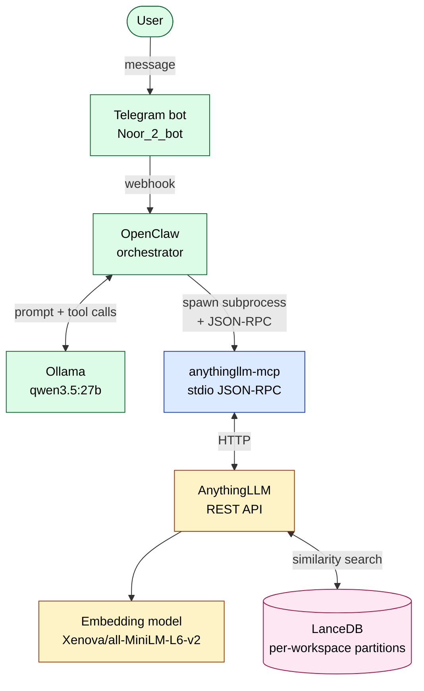
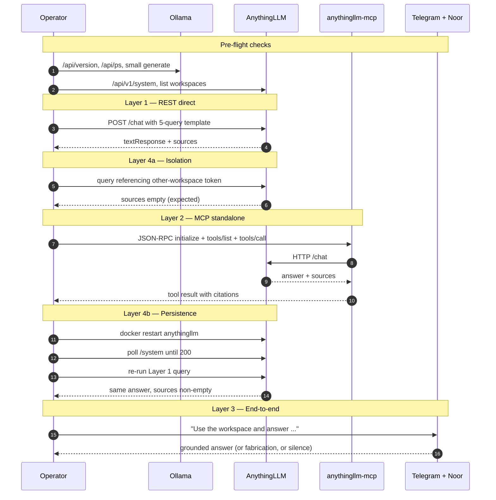
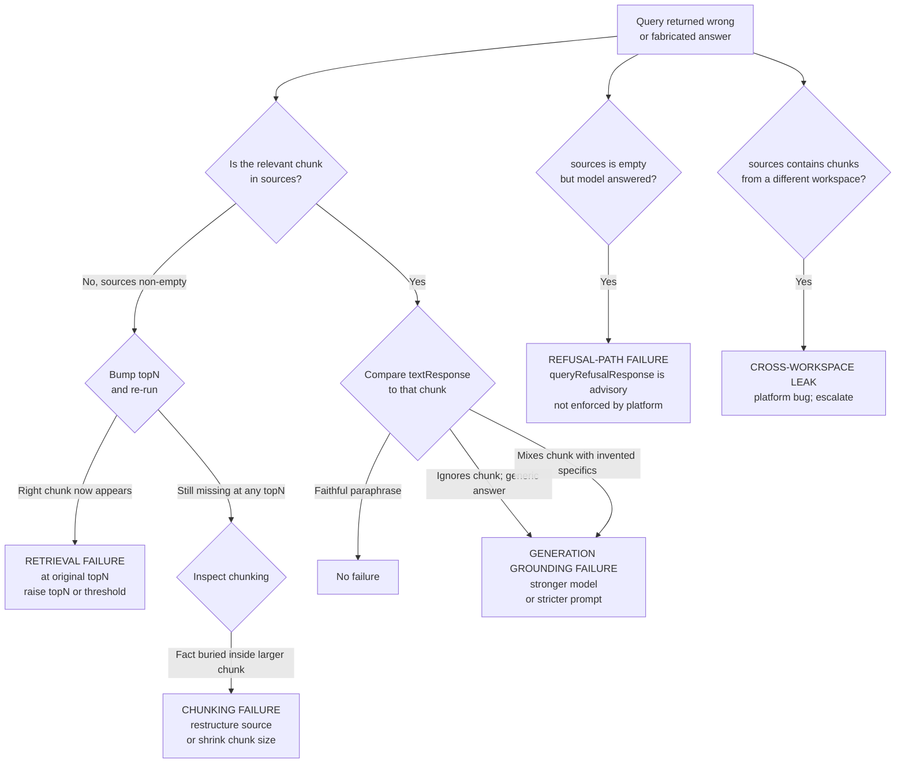

# RAG Validation Runbook

A runbook for confirming that a self-hosted RAG workspace is fully operational — across the REST API, the MCP stdio server, the user-facing chat surface, and the underlying vector database. Originated from a live validation run on AnythingLLM, OpenClaw, Ollama, and a Telegram bot in early May 2026.

## Why this runbook exists

A self-hosted RAG workspace can fail in several quiet ways: vectors that index but don't retrieve well; retrieval that works but generation that fabricates anyway; a refusal path that doesn't actually refuse; vector partitions that leak across workspaces; data that doesn't survive a container restart. Each of these failures looks like a "wrong answer" on the surface, and the surface tests that ship with most platforms — a single-query smoke test, a UI confirming the doc was uploaded — do not separate them.

This runbook treats RAG validation as a four-layer concern. Each layer corresponds to a real boundary in the deployed system, and each layer is testable independently. Walk all four and the workspace is operationally validated; skip a layer and you ship with a known blind spot.

The originating validation run was on a self-hosted AnythingLLM instance running in Docker on a Linux workstation, with Ollama as the inference backend, a custom MCP stdio server bridging an orchestrator (OpenClaw) to AnythingLLM, and a Telegram bot (Noor) as the user-facing channel. Most findings generalise; platform-specific quirks are flagged inline throughout the docs.

## Architecture at a glance



Each colour corresponds to one layer test:

- **Layer 1** (yellow) probes AnythingLLM directly via REST. Confirms the embedding model, the vector store, and the workspace's chat model in their simplest form.
- **Layer 2** (blue) probes the MCP server in isolation, with no chat model in the loop. Documents the tool contract.
- **Layer 3** (green) sends a real message through the user-facing channel. Confirms the workspace is reachable as users will reach it.
- **Layer 4** (pink) examines LanceDB's partitioning and persistence behaviour from outside, via cross-workspace probes and a container-restart probe.

## The four-layer model

A workspace is "fully operational" only when it answers correctly across all four layers, not just one. Each layer proves something the layers above it cannot.

### Layer 1 — REST direct

A `curl` against `/api/v1/workspace/{slug}/chat` returns grounded answers with source citations. If Layer 1 fails, every other layer will fail. If Layer 1 passes, higher layers can still fail for reasons unrelated to RAG. This is the right place to grade retrieval quality (the `sources` array), generation faithfulness (does `textResponse` paraphrase the source or invent), and refusal behaviour (does the model honour empty retrieval).

### Layer 2 — MCP standalone

Pipe line-delimited JSON-RPC into the MCP stdio server and confirm it returns the same grounded answers. Layer 2 documents the tool contract: argument names, response shape, error format. It also gives a clean latency baseline for the MCP-mediated path. Subtracting Layer 2 latency from Layer 3 latency tells you whether a slow user-facing answer is the model's fault or the RAG plumbing's fault.

### Layer 3 — End-to-end via the assistant surface

Send a real message through the user-facing channel and observe the answer. Layer 3 is the only layer that confirms the workspace is reachable as users will reach it. It is also the slowest and most coupled — many failure modes can produce a wrong answer here, and Layers 1 and 2 are the way to localise which one. A correct Layer 3 answer that came back in seconds proves the entire chain works at the moment of the test; a slow or wrong answer requires lower-layer tests to localise.

### Layer 4 — Data hygiene

Two distinct probes:

- **4a — Workspace isolation.** A query against workspace A whose answer only exists in workspace B. The expected outcome is `sources: []`. If chunks from B leak in, the vector partitioning is broken at the storage layer.
- **4b — Persistence across restart.** Stop and restart the AnythingLLM container, then re-run a Layer 1 query. Same answer with non-empty sources confirms vectors persist to host disk; an empty `sources` array confirms the embedding store is in-memory-only and your RAG state would not survive a node reboot.

Layer 4 protects against silent corruption modes that Layers 1–3 will not catch on a healthy day.

## The validation sequence

Order matters. Pre-flight first rules out infrastructure noise; Layer 1 establishes a baseline; 4a is cheap and catches a particularly bad failure mode early; Layer 2 confirms the orchestrator-side contract; 4b requires a service interruption and is best done before the user-facing test; Layer 3 is the slowest and confirms operational reachability last.



The pre-flight checks (see `docs/06-pre-flight-checks.md`) take seconds. Layer 1 with the five-query template takes minutes. Layer 2 takes minutes once you have the MCP harness in hand. Layer 4b takes under a minute including the restart. Layer 3 takes a few minutes if the chat model is responsive, much longer if the inference backend is wedged.

## When something fails — triage at a glance

The decision tree localises the fault using data already in the chat response (`sources`, `textResponse`, `metrics`) plus one or two follow-up probes. Full prose lives in `docs/04-failure-mode-triage.md`; the visual is here.



Each failure mode has a different remedy. Conflating them — for example, raising `topN` on a chunking failure, or switching models on a retrieval failure — wastes effort and does not fix the underlying issue.

## Quick start

If you want to validate a workspace right now with no prior context:

1. **Pre-flight** — confirm Ollama and AnythingLLM are reachable. See `docs/06-pre-flight-checks.md`. About one minute.
2. **Setup** — create the workspace, upload the corpus, configure the chat model. See `docs/02-setup-checklist.md`. About five minutes.
3. **Validation queries** — run the five-query template against your corpus. See `docs/03-validation-queries.md`. About five minutes.
4. **Layer-by-layer** — work through the layer tests in `docs/05-layer-tests/` in the order shown in the sequence diagram above. About fifteen minutes for all four layers.
5. **Triage** — if any query fails, jump to `docs/04-failure-mode-triage.md` and follow the decision tree.

Total time for a fresh validation: under thirty minutes if the platform is healthy.

## Worked example — the originating run

The runbook's structure was extracted from a single live validation run on workspace #10 (`continuous-delivery-guidelines-rule-book-for-development`) on 2026-05-04 and 2026-05-05, against a 5,659-word corpus loaded as one Markdown document. Real findings from that run, by layer:

**Layer 1 (REST direct).** Five queries (direct lookup, carve-out, cross-rule synthesis, disambiguation, out-of-corpus) on llama3.2:3b at `topN=4`. Two queries failed: the cross-rule synthesis on small-model fabrication, and the out-of-corpus probe on retrieval missing the relevant chunk. A `topN=8` retest surfaced the missing chunk for the synthesis query but produced a byte-identical fabricated answer — confirming a generation-grounding failure rather than a retrieval failure for that case. The other failed query missed at any `topN`, pointing to a chunking failure rather than a retrieval failure.

**Layer 2 (MCP standalone).** Tool name is bare `rag_query` at the MCP layer; the orchestrator prepends the server name to produce `<server-name>__rag_query` for the chat model. Required arguments are `workspace` (slug) and `question`, not `query` — a common mismatch worth knowing. Source citations are filename-only at this layer — no chunk references — which limits faithfulness checking in MCP-mediated paths. End-to-end probe latency was 15.7 seconds, of which roughly three to five seconds is fixed Python subprocess startup overhead per call.

**Layer 3 (Telegram end-to-end).** An explicit-workspace query returned a verbatim-correct paraphrase of the source rule. Round-trip was about six minutes, dominated by the chat model's tool-calling and final-answer generation cycle on the inference backend, not by the RAG plumbing. A follow-up turn that did not name the workspace still surfaced workspace content — conversation-context carryover, useful for continuity but worth knowing when a fresh-context answer is expected.

**Layer 4a (workspace isolation).** Two cross-workspace probes (queries referencing tokens that exist only in another workspace) returned `sources: []`. LanceDB partitioning enforces correctly. The chat model still produced a confident answer on one of the two probes — a refusal-path failure, separate from isolation.

**Layer 4b (persistence).** `docker restart anythingllm` preserved every workspace setting, the document's `docId` and embedding timestamp, and vector queryability. The same query before and after the restart returned functionally identical answers with non-empty sources. Recovery took under thirty seconds.

Two infrastructure issues were observed during the run and are not RAG failures but worth noting: an Ollama runner crash with the signature `llama runner process has terminated: %!w(<nil>)` (likely linked to AMD ROCm at high context size on Ollama 0.20.x) required a daemon restart; and the `queryRefusalResponse` workspace setting was confirmed as advisory rather than enforced — the model decides whether to use the configured string when retrieval is empty.

## Repository layout

```
README.md                           this file
LICENSE                             All Rights Reserved
docs/
  01-overview.md                    the four-layer model, full prose
  02-setup-checklist.md             workspace creation through verification
  03-validation-queries.md          5-query template + grading method
  04-failure-mode-triage.md         decision tree, full prose
  05-layer-tests/
    rest-direct.md                  Layer 1
    mcp-standalone.md               Layer 2 (with /tmp/mcp_probe.py recipe)
    telegram-end-to-end.md          Layer 3
    workspace-isolation.md          Layer 4a
    persistence.md                  Layer 4b
  06-pre-flight-checks.md           Ollama + AnythingLLM liveness
  appendix-api-snippets.md          REST snippet reference
  appendix-known-quirks.md          non-obvious platform behaviours
```

## Status, scope, licence

This is a v1 runbook. It captures what was tested in the originating session and nothing speculative. Future revisions extend with additional probes (chunking inspection, embedding-model swap, similarity-threshold tuning, multi-document corpora) only when those probes have actually been run against a live system.

Where a finding is platform-specific (AnythingLLM, LanceDB, Xenova embeddings, Ollama with AMD ROCm, OpenClaw orchestrator, Noor on Telegram), it is flagged inline in the relevant doc. Many findings generalise to other RAG stacks; check the assumptions before applying.

All Rights Reserved. See `LICENSE`.
